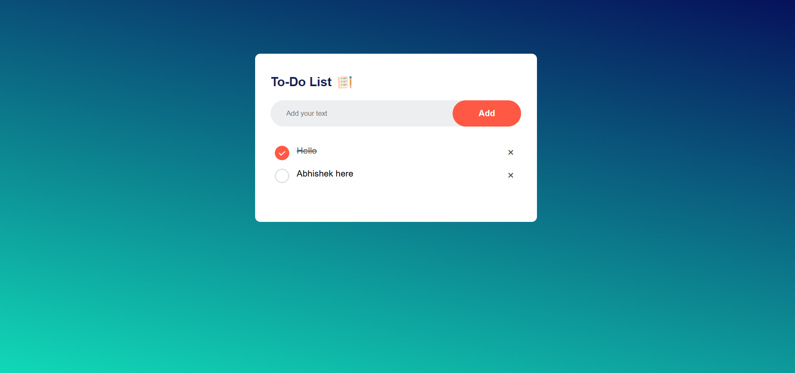
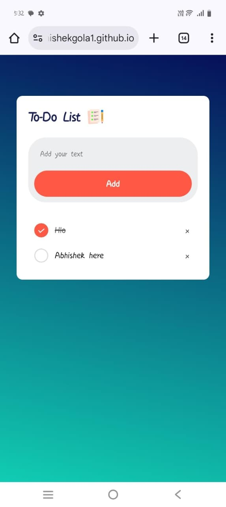

# 📝 To-Do List App

A simple and responsive **To-Do List web application** that allows users to:  
- Add tasks  
- Mark tasks as completed  
- Delete tasks  
- Save tasks in the browser using **localStorage** (data persists even after refresh)

---

## 🔗 Project Link
[View Live Project](https://abhishekgola1.github.io/To-Do-List-App/)

---

## 💻 Desktop View

## 📱 Mobile View

---

## ⚙️ Features
- Add new tasks with input field
- Delete tasks using ❌ button
- Mark tasks as completed by clicking on them
- Persist tasks in browser using **localStorage**
- Fully responsive UI for desktop and mobile

---

## 🛠️ Tech Stack
- HTML  
- CSS  
- JavaScript  

